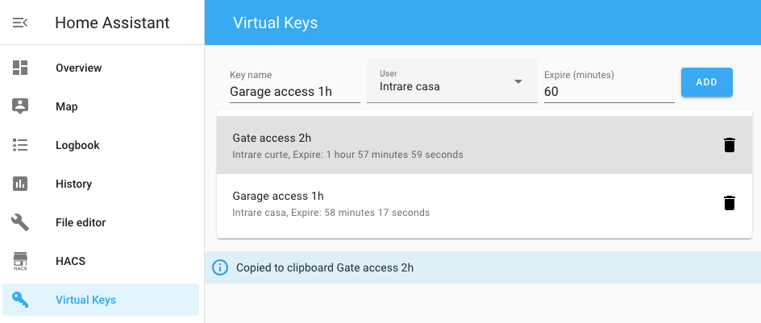

# Lovelace Virtual Keys
[](https://github.com/hacs/integration)

Create login link for [Home Assistant](https://www.home-assistant.io/) that you can share with guests.



## Description

Lovelace Virtual Keys is a Home Assistant plugin that allows you to create login links that can be shared with guests. These links provide access to specific entities in Home Assistant for a limited time.

## Installation

Both [Virtual Keys](https://github.com/kcsoft/virtual-keys) integration and the [Lovelace plugin](https://github.com/kcsoft/lovelace-virtual-keys) need to be installed.

### HACS installation

You need to install [HACS](https://hacs.xyz/) first.

1. Install the [Virtual Keys](https://github.com/kcsoft/virtual-keys) integration.

2. Add "Custom repositories" to HACS, paste the URL of this repository and select "Plugin" as category.

3. Go to HACS -> Integrations, Explore and Download Repositories, search for "virtual keys" and install it.

4. Add the following to `configuration.yaml`:

```yaml
panel_custom:
  - name: virtual-keys-panel
    require_admin: true
    url_path: virtual-keys
    sidebar_title: Virtual Keys
    sidebar_icon: mdi:key-variant
    module_url: /local/community/virtual-keys/virtual-keys.js
```

6. Restart Home Assistant.

## Use case

I want to share a "virtual key" with my friends that is valid for a limited time and that they can use to access specific entities in Home Assistant like the front gate. The key is actually a link to my Home Assistant that can be opened in a browser.

To make this work, I need to make some additional steps (after installing Virtual Keys):

1. Create a new user in Home Assistant, e.g., "guest".

2. Create a new group, e.g., "guests", and add the user "guest" to it, and also the devices you want to give access to, e.g., "cover.front_gate". Instructions [here](https://developers.home-assistant.io/blog/2019/03/11/user-permissions/).

3. Create a new View (tab) in the default Lovelace UI and add the entities you want to give access to, e.g., "cover.front_gate", set the visibility to only show to user "guest".

4. Install [kiosk-mode](https://github.com/NemesisRE/kiosk-mode) and configure it to set "kiosk" mode for user "guest".

That's it, you can now create Virtual Keys and share the link.
